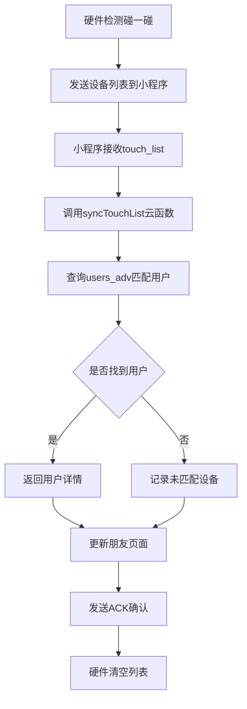

# 🎯 Unian小程序后端架构文档

## 📋 目录
1. [概述](#概述)
2. [数据库结构](#数据库结构)
3. [云函数架构](#云函数架构)
4. [碰一碰社交功能实现](#碰一碰社交功能实现)
5. [数据流程](#数据流程)
6. [API接口说明](#api接口说明)

---

## 概述

Unian小程序采用微信云开发架构，使用云数据库存储用户数据，云函数处理业务逻辑。

### 技术栈
- **前端**: 微信小程序原生框架
- **后端**: 微信云开发（Cloud Base）
- **数据库**: 云数据库（NoSQL）
- **云函数**: Node.js运行环境

### 项目结构
```
UnionMiniApp_YY-main/
├── miniprogram/          # 小程序前端代码
├── cloudfunctions/       # 云函数代码
│   ├── submitQuestionnaire/  # 提交问卷和标签数据
│   ├── getUserData/          # 获取用户数据
│   ├── classifyUsers/        # 用户分类
│   └── syncTouchList/        # [新增]同步碰一碰列表
└── project.config.json   # 项目配置
```

---

## 数据库结构

### 1. users_adv 集合（高级用户数据）
存储用户的标签、个人信息和硬件配置。

```javascript
{
  _id: "自动生成的ID",
  openid: "用户唯一标识",
  userInfo: {
    nickName: "用户昵称",
    avatarUrl: "头像URL"
  },
  advancedTags: {
    displayName: "显示名称",
    professionalTags: ["标签1", "标签2"],
    interestTags: ["标签3", "标签4"],
    personalityTags: ["标签5"],
    quirkyTags: ["标签6"],
    threshold: 2,  // 🔧 匹配阈值（与硬件 DEFAULT_TAG_THRESHOLD 同步）
    updateTime: Date
  },
  encodedTags: "Un**************",  // 14字符编码的蓝牙名称
  bluetoothName: "Un**************", // [新增]蓝牙设备名称
  binaryArray: [0,1,0,1...],        // 84位二进制数组
  allTagsList: ["所有可选标签"],
  selectedTags: ["已选标签"],
  touchList: [                       // [新增]碰一碰设备列表
    {
      deviceName: "Un**************",
      firstTouchTime: Date,
      linkedOpenid: "对方的openid（如果已匹配）",
      linkedUserInfo: {}  // 对方的用户信息（如果已匹配）
    }
  ],
  createTime: Date,
  updateTime: Date
}
```

### 2. users_bar 集合（原有问卷数据）
保留原有的问卷系统数据。

### 3. touch_records 集合 [新增]
记录所有碰一碰事件，用于数据分析和社交图谱构建。

```javascript
{
  _id: "自动生成的ID",
  deviceA: "Un**************",  // 设备A的蓝牙名称
  deviceB: "Un**************",  // 设备B的蓝牙名称
  openidA: "用户A的openid（如果已知）",
  openidB: "用户B的openid（如果已知）",
  touchTime: Date,              // 碰一碰时间
  location: {},                  // 位置信息（如果有）
  matchScore: 6,                 // 匹配的标签数量
  status: "matched/pending"      // 匹配状态
}
```

---

## 云函数架构

### 现有云函数

#### 1. submitQuestionnaire
- **功能**: 提交用户标签数据和蓝牙名称
- **更新内容**: 
  - 保存蓝牙名称（encodedTags字段）到bluetoothName字段
  - 每次更新标签时同步更新蓝牙名称

#### 2. getUserData
- **功能**: 获取用户数据
- **更新内容**: 返回bluetoothName字段

### 新增云函数

#### 3. syncTouchList [新增]
- **功能**: 同步碰一碰设备列表，匹配数据库用户
- **输入参数**:
```javascript
{
  openid: "当前用户openid",
  touchList: [
    {
      name: "Un**************",
      first_touch: 1234567890
    }
  ]
}
```
- **处理逻辑**:
  1. 接收碰一碰设备列表
  2. 根据蓝牙名称查询users_adv集合
  3. 匹配到的用户返回完整信息
  4. 未匹配的返回基础信息
  5. 更新当前用户的touchList字段
  6. 记录到touch_records集合

- **返回数据**:
```javascript
{
  success: true,
  matchedUsers: [
    {
      deviceName: "Un**************",
      openid: "匹配到的openid",
      displayName: "用户显示名称",
      avatarUrl: "头像URL",
      tags: ["标签列表"],
      matchScore: 6,  // 匹配的标签数
      firstTouchTime: Date
    }
  ],
  unmatchedDevices: [
    {
      deviceName: "Un**************",
      firstTouchTime: Date
    }
  ]
}
```

---

## 碰一碰社交功能实现

### 1. 数据流程



### 2. 实现步骤

#### Step 1: 更新submitQuestionnaire云函数
在保存encodedTags时，同时保存到bluetoothName字段：

```javascript
// 在 handleAdvancedTags 函数中
const saveData = {
  // ... 其他字段
  encodedTags: encodedTags || '',
  bluetoothName: encodedTags ? `Un${encodedTags}` : '', // 添加Un前缀
  // ...
}
```

#### Step 2: 创建syncTouchList云函数
处理碰一碰列表同步和用户匹配。

#### Step 3: 修改device.js
在接收到touch_list时，调用云函数同步数据：

```javascript
// 在 updateUnDevicesListFromJSON 函数中
if (jsonData.type === 'touch_list' && jsonData.devices) {
  // 调用云函数同步
  wx.cloud.callFunction({
    name: 'syncTouchList',
    data: {
      openid: this.data.userOpenId,
      touchList: jsonData.devices
    }
  }).then(res => {
    // 处理返回的匹配结果
    // 可以存储到全局或传递到朋友页面
  });
}
```

#### Step 4: 修改connect.js（朋友页面）
展示碰一碰的社交关系：

```javascript
// 页面数据结构
data: {
  touchFriends: [],      // 碰一碰的朋友列表
  pendingDevices: [],    // 未注册的设备列表
}

// 加载碰一碰朋友
loadTouchFriends() {
  wx.cloud.callFunction({
    name: 'getUserTouchList',
    data: {
      openid: this.data.currentUserOpenId
    }
  }).then(res => {
    this.setData({
      touchFriends: res.result.matchedUsers,
      pendingDevices: res.result.unmatchedDevices
    });
  });
}
```

### 3. 前端页面修改

#### 朋友页面（connect）UI更新
- 将页面标题从"连接"改为"朋友"
- 展示两个列表：
  1. **已注册朋友**: 显示头像、昵称、匹配标签数
  2. **待连接设备**: 显示设备ID、首次碰一碰时间

---

## 数据流程

### 1. 用户注册流程
```
用户填写标签 -> 生成Un编码 -> 发送到硬件 -> 保存到数据库(bluetoothName字段)
```

### 2. 碰一碰流程
```
硬件检测碰一碰 -> 记录设备列表 -> 连接小程序 -> 上传列表 -> 云函数匹配 -> 展示社交关系
```

### 3. 数据同步流程
```
硬件(touch_list) -> 小程序(device.js) -> 云函数(syncTouchList) -> 数据库(users_adv) -> 朋友页面(connect.js)
```

---

## API接口说明

### 1. 蓝牙通信协议

#### 发送到硬件
```javascript
// 设置蓝牙名称
{
  "type": "set_un_string",
  "un_string": "Un**************"
}

// 确认收到碰一碰列表
{
  "type": "touch_list_ack"
}
```

#### 从硬件接收
```javascript
// 碰一碰设备列表
{
  "type": "touch_list",
  "count": 2,
  "devices": [
    {
      "name": "Un**************",
      "first_touch": 1234567890
    }
  ]
}
```

### 2. 云函数接口

#### syncTouchList
- **调用方式**: `wx.cloud.callFunction`
- **参数**: `{ openid, touchList }`
- **返回**: `{ matchedUsers, unmatchedDevices }`

#### getUserTouchList [待实现]
- **调用方式**: `wx.cloud.callFunction`
- **参数**: `{ openid }`
- **返回**: 用户的碰一碰朋友列表

---

## 注意事项

1. **数据一致性**: 每次更新标签必须同步更新bluetoothName字段
2. **隐私保护**: 未注册用户只显示设备ID，不暴露个人信息
3. **性能优化**: 批量查询蓝牙名称时使用索引
4. **错误处理**: 云函数需要处理各种异常情况

## 后续优化建议

1. **社交图谱分析**: 基于touch_records构建用户社交网络
2. **推荐算法**: 根据共同碰一碰的朋友推荐新朋友
3. **活动追踪**: 记录碰一碰的时间和地点，生成社交热力图
4. **消息通知**: 当碰一碰的设备注册后，通知已有用户

---

*文档版本: 1.0*  
*更新日期: 2024年12月*  
*作者: Unian开发团队*