# Unian小程序前端跳转流程图 / Frontend Navigation Flow Chart

## 概述 / Overview

本文档详细描述了Unian兴趣匹配小程序的前端页面跳转流程，涵盖所有用户交互场景和状态变化。
This document provides a comprehensive description of the frontend navigation flow for the Unian interest matching mini-program, covering all user interaction scenarios and state changes.

## 目录 / Table of Contents

1. [总体架构 / Overall Architecture](#总体架构--overall-architecture)
2. [页面详细流程 / Detailed Page Flows](#页面详细流程--detailed-page-flows)
3. [用户场景分支 / User Scenario Branches](#用户场景分支--user-scenario-branches)
4. [异常处理流程 / Exception Handling Flows](#异常处理流程--exception-handling-flows)
5. [状态管理机制 / State Management Mechanism](#状态管理机制--state-management-mechanism)

---

## 总体架构 / Overall Architecture

### 页面结构 / Page Structure

Unian小程序包含5个主要页面：
The Unian mini-program consists of 5 main pages:

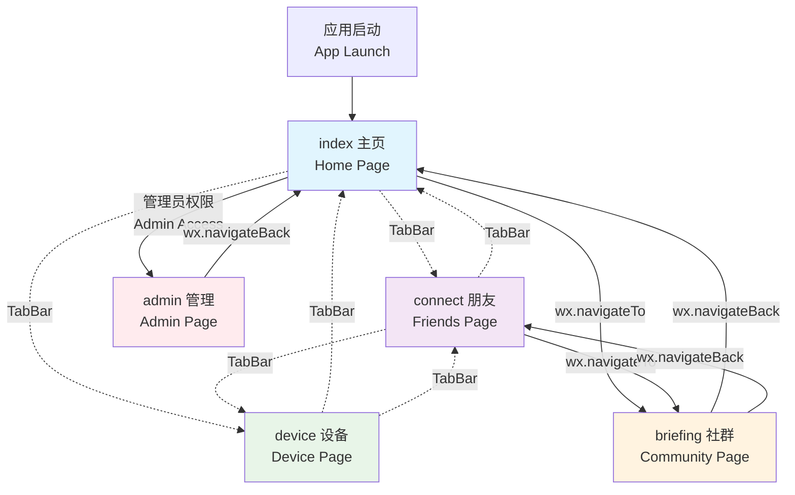

### TabBar导航机制 / TabBar Navigation Mechanism

TabBar使用自定义组件`custom-tab-bar/index.js`实现：
TabBar is implemented using custom component `custom-tab-bar/index.js`:

- **默认选中 / Default Selected**: index (主页 / Home) - selected: 2
- **切换方法 / Switch Method**: `wx.switchTab()`
- **状态同步 / State Sync**: 全局状态管理 / Global state management

代码位置 / Code Location: `custom-tab-bar/index.js:27-60`

---

## 页面详细流程 / Detailed Page Flows

### 1. 主页流程 (index) / Home Page Flow

主页具有双模式设计：资料展示模式和问卷编辑模式。
The home page features a dual-mode design: profile display mode and questionnaire editing mode.

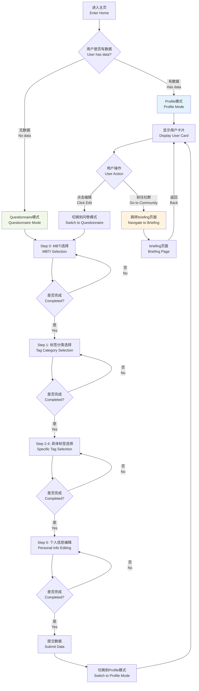

**关键状态变量 / Key State Variables:**
- `viewMode`: 'profile' | 'questionnaire'
- `currentStep`: 0-5 (问卷步骤 / Questionnaire steps)
- `hasUserInfo`: 是否有用户数据 / Whether user data exists

**代码位置 / Code Locations:**
- 模式切换 / Mode switching: `pages/index/index.js` (搜索 switchToProfileView, switchToQuestionnaireView)
- 步骤控制 / Step control: 问卷流程相关函数 / Questionnaire flow functions

### 2. 设备页面流程 (device) / Device Page Flow

设备页面负责蓝牙设备的扫描、连接、绑定和数据同步。
The device page handles Bluetooth device scanning, connection, binding, and data synchronization.

```mermaid
graph TD
    A[进入设备页面<br/>Enter Device Page] --> B{是否有绑定设备<br/>Has bound device?}
    
    B -->|有<br/>Yes| C[自动连接绑定设备<br/>Auto-connect bound device]
    B -->|无<br/>No| D[开始设备发现<br/>Start device discovery]
    
    %% 设备发现流程
    D --> D1[开始蓝牙扫描<br/>Start BLE scanning]
    D1 --> D2[过滤Un开头设备<br/>Filter Un-prefixed devices]
    D2 --> D3{发现设备<br/>Device found?}
    
    D3 -->|否<br/>No| D4[显示扫描状态<br/>Show scanning status]
    D4 --> D3
    D3 -->|是<br/>Yes| D5[按信号强度排序<br/>Sort by RSSI strength]
    D5 --> D6[推荐最强信号设备<br/>Recommend strongest signal]
    
    %% 连接流程
    D6 --> E[用户点击连接<br/>User clicks connect]
    C --> E
    E --> E1[BLE连接建立<br/>Establish BLE connection]
    
    E1 --> E2{连接成功<br/>Connection success?}
    E2 -->|否<br/>No| E3[重试连接(最多3次)<br/>Retry connection (max 3)]
    E3 --> E4{重试次数用完<br/>Max retries reached?}
    E4 -->|否<br/>No| E1
    E4 -->|是<br/>Yes| E5[连接失败<br/>Connection failed]
    E5 --> D6
    
    E2 -->|是<br/>Yes| F[GATT服务发现<br/>GATT service discovery]
    F --> F1[MTU协商<br/>MTU negotiation]
    F1 --> F2[硬件确认(蓝灯闪烁)<br/>Hardware confirmation (blue flash)]
    
    %% 身份验证和绑定
    F2 --> G{是否首次连接<br/>First time connection?}
    G -->|是<br/>Yes| G1[执行设备绑定<br/>Execute device binding]
    G -->|否<br/>No| H[身份信息交换<br/>Identity exchange]
    
    G1 --> G2[保存绑定信息<br/>Save binding info]
    G2 --> G3[设置阻止其他设备<br/>Block other devices]
    G3 --> H
    
    %% 数据同步流程
    H --> H1[发送Un字符串<br/>Send Un string]
    H1 --> H2{硬件确认<br/>Hardware ACK?}
    H2 -->|否<br/>No| H3[3秒超时断开<br/>3s timeout disconnect]
    H2 -->|是<br/>Yes| H4[请求碰一碰列表<br/>Request touch list]
    
    H4 --> H5[接收碰一碰数据<br/>Receive touch data]
    H5 --> H6[发送确认给硬件<br/>Send ACK to hardware]
    H6 --> H7[硬件清空Flash<br/>Hardware clears Flash]
    H7 --> I[连接完成<br/>Connection complete]
    
    %% 用户操作
    I --> I1{用户操作<br/>User action}
    I1 -->|同步数据<br/>Sync data| H1
    I1 -->|断开连接<br/>Disconnect| I2[强制断开<br/>Force disconnect]
    I1 -->|解绑设备<br/>Unbind device| I3[清除绑定信息<br/>Clear binding]
    
    I2 --> D6
    I3 --> D6
    
    style D fill:#e8f5e8
    style E fill:#fff3e0
    style H fill:#f3e5f5
    style I fill:#e1f5fe
```

**关键状态变量 / Key State Variables:**
- `connected`: 连接状态 / Connection status
- `scanning`: 扫描状态 / Scanning status  
- `boundDevice`: 绑定设备信息 / Bound device info
- `_forceDisconnecting`: 强制断开标志 / Force disconnect flag

**代码位置 / Code Locations:**
- 扫描逻辑 / Scanning logic: `pages/device/device.js:1421-1425`
- 绑定检查 / Binding check: `pages/device/device.js:585-643`
- 握手协议 / Handshake protocol: `utils/ble-handshake-client.js`

### 3. 朋友页面流程 (connect) / Friends Page Flow

朋友页面展示用户的社交连接，支持卡片浏览和详情查看。
The friends page displays user's social connections with card browsing and detail viewing capabilities.

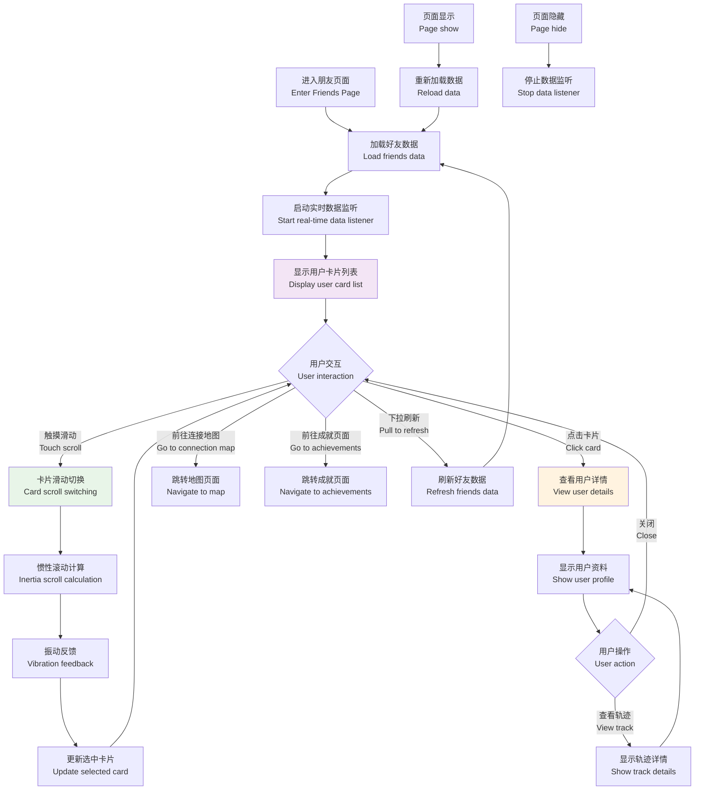

**关键功能特性 / Key Features:**
- **滑动交互 / Scroll Interaction**: 支持惯性滚动和振动反馈 / Supports inertia scrolling and vibration feedback
- **实时更新 / Real-time Updates**: 定时刷新好友数据 / Periodic refresh of friends data
- **卡片动效 / Card Animation**: 滑动时卡片缩放效果 / Card scaling effect during scrolling

**代码位置 / Code Locations:**
- 触摸处理 / Touch handling: `pages/connect/connect.js:374-534`
- 数据加载 / Data loading: `pages/connect/connect.js:320-355`
- 用户详情 / User details: `pages/connect/connect.js:920-1046`

### 4. 社群页面流程 (briefing) / Community Page Flow

社群页面支持主题切换和社群内容浏览。
The community page supports theme switching and community content browsing.

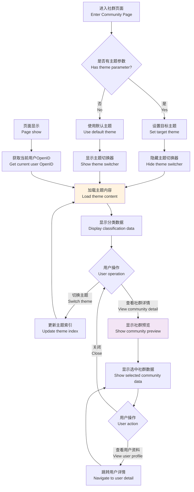

**参数传递机制 / Parameter Passing Mechanism:**
- **来源页面 / Source pages**: index, connect
- **传递参数 / Parameters**: theme (主题名称), themeIndex (主题索引)  
- **处理逻辑 / Processing logic**: `onLoad` 函数中解码参数 / Decode parameters in `onLoad` function

**代码位置 / Code Locations:**
- 主题切换 / Theme switching: `pages/briefing/briefing.js:25-32`
- 参数处理 / Parameter handling: `pages/briefing/briefing.js:34-75`
- 社群详情 / Community details: `pages/briefing/briefing.js:192-237`

### 5. 管理页面流程 (admin) / Admin Page Flow

管理页面提供主题管理和系统配置功能。
The admin page provides theme management and system configuration features.

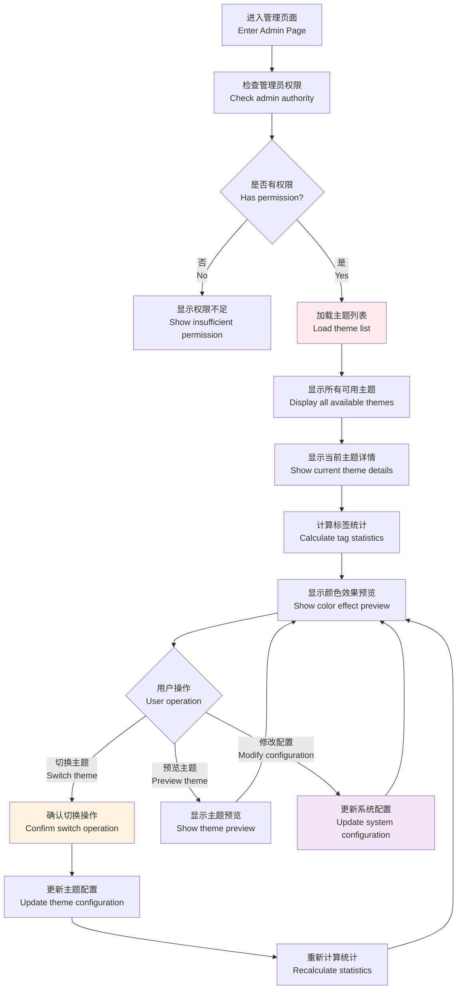

**权限控制 / Permission Control:**
- **权限检查 / Permission check**: `checkAdminAuth()` 函数
- **当前实现 / Current implementation**: 临时设置为true (待完善后端验证)
- **未来规划 / Future plan**: 通过后端API验证管理员身份

**代码位置 / Code Locations:**
- 权限检查 / Permission check: `pages/admin/admin.js:25-31`
- 主题管理 / Theme management: `pages/admin/admin.js:93-120`
- 配置引用 / Configuration reference: `config/tagThemes.js`

---

## 用户场景分支 / User Scenario Branches

### 新用户首次使用 / New User First Time Usage

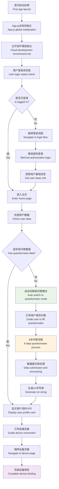

### 老用户日常使用 / Returning User Daily Usage

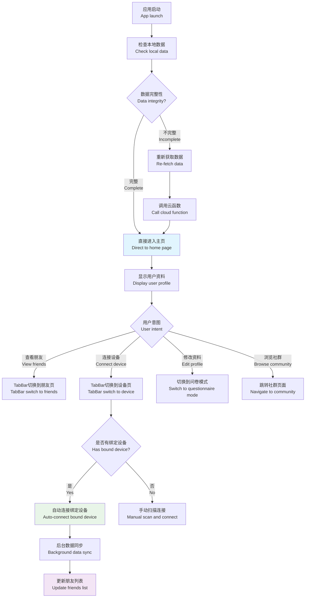

### 设备连接异常场景 / Device Connection Exception Scenarios

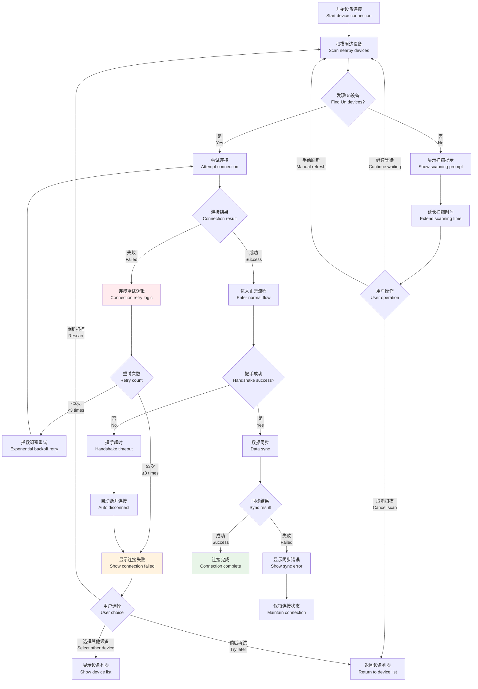

---

## 异常处理流程 / Exception Handling Flows

### 网络异常处理 / Network Exception Handling

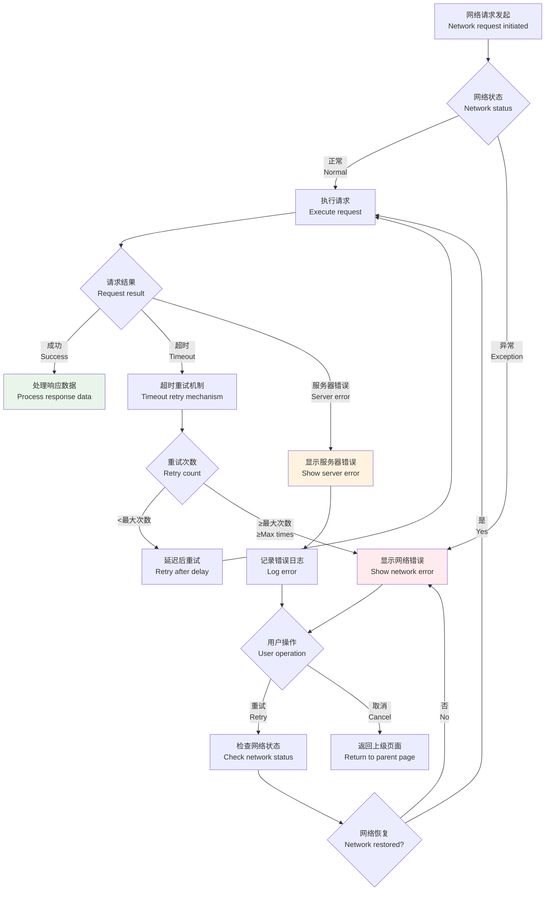

### 权限异常处理 / Permission Exception Handling

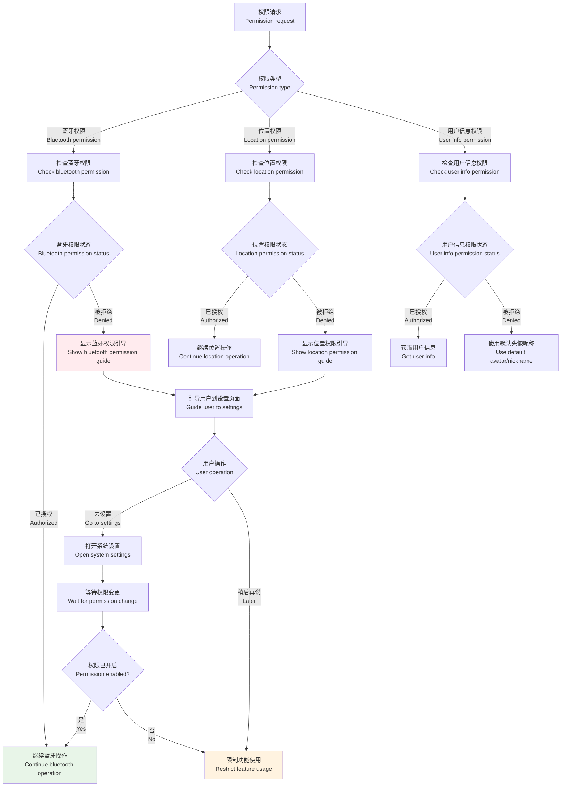

---

## 状态管理机制 / State Management Mechanism

### 全局状态管理 / Global State Management

应用使用`app.js`中的`globalData`进行全局状态管理：
The app uses `globalData` in `app.js` for global state management:

```javascript
// 全局数据结构 / Global data structure
globalData: {
  userInfo: null,        // 用户信息 / User information
  logged: false,         // 登录状态 / Login status  
  openid: '',           // 用户OpenID / User OpenID
  tabBar: {             // TabBar状态 / TabBar status
    selected: 2,        // 选中索引 / Selected index
    lastUpdateTime: 0   // 最后更新时间 / Last update time
  }
}
```

### 页面状态同步 / Page State Synchronization

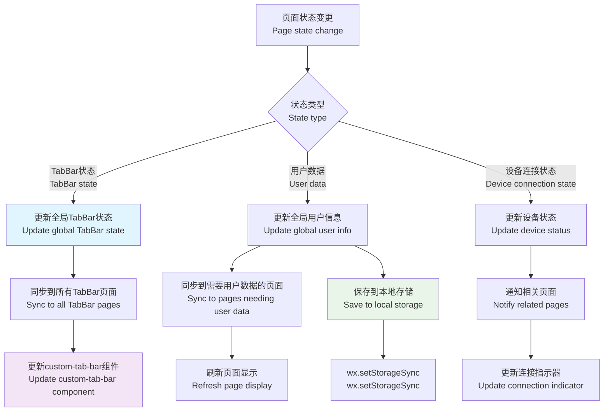

### 数据持久化策略 / Data Persistence Strategy

| 数据类型 / Data Type | 存储位置 / Storage Location | 生命周期 / Lifecycle | 同步时机 / Sync Timing |
|---------------------|---------------------------|-------------------|----------------------|
| 用户基础信息 / User basic info | wx.storage | 长期 / Long-term | 登录时 / On login |
| 设备绑定信息 / Device binding info | wx.storage | 长期 / Long-term | 绑定时 / On binding |
| 问卷填写进度 / Questionnaire progress | 内存 / Memory | 会话期 / Session | 实时 / Real-time |
| 好友列表数据 / Friends list data | 内存 / Memory | 页面期 / Page | 页面显示时 / On page show |
| TabBar选中状态 / TabBar selected state | 全局内存 / Global memory | 应用期 / App | 切换时 / On switch |

---

## 代码结构参考 / Code Structure Reference

### 关键文件位置 / Key File Locations

```
UnionMiniApp_YY-main/
├── miniprogram/
│   ├── app.js                          # 应用全局逻辑 / App global logic
│   ├── app.json                        # 应用配置 / App configuration  
│   ├── custom-tab-bar/
│   │   └── index.js                    # 自定义TabBar / Custom TabBar
│   ├── pages/
│   │   ├── index/index.js              # 主页逻辑 / Home page logic
│   │   ├── connect/connect.js          # 朋友页逻辑 / Friends page logic
│   │   ├── device/device.js            # 设备页逻辑 / Device page logic
│   │   ├── briefing/briefing.js        # 社群页逻辑 / Community page logic
│   │   └── admin/admin.js              # 管理页逻辑 / Admin page logic
│   ├── utils/
│   │   ├── ble-handshake-client.js     # BLE握手协议 / BLE handshake protocol
│   │   └── config.js                   # 全局配置 / Global configuration
│   └── config/
│       ├── tagThemes.js                # 主题配置 / Theme configuration
│       └── device-selection-config.js # 设备选择配置 / Device selection config
```

### 核心函数索引 / Core Function Index

| 功能模块 / Feature Module | 关键函数 / Key Functions | 文件位置 / File Location |
|-------------------------|-------------------------|------------------------|
| 页面跳转 / Page Navigation | `wx.switchTab()`, `wx.navigateTo()` | 各页面文件 / All page files |
| TabBar控制 / TabBar Control | `switchTab()`, `updateSelected()` | custom-tab-bar/index.js |
| 设备连接 / Device Connection | `connectToDevice()`, `startBoundDeviceFlow()` | pages/device/device.js |
| 状态管理 / State Management | `setTabBarIndex()`, `checkLoginStatus()` | app.js |
| 数据同步 / Data Sync | `refreshFriendsData()`, `syncTouchList()` | pages/connect/connect.js |

---

## 总结 / Summary

本流程图文档详细描述了Unian小程序的完整前端导航架构，包括：
This flow chart document provides a detailed description of the complete frontend navigation architecture of the Unian mini-program, including:

1. **5个核心页面的交互逻辑 / Interactive logic of 5 core pages**
2. **TabBar和导航跳转机制 / TabBar and navigation mechanism**  
3. **用户使用场景的完整路径 / Complete user scenario paths**
4. **异常处理和容错机制 / Exception handling and fault tolerance**
5. **状态管理和数据持久化 / State management and data persistence**

此文档可作为开发维护和用户体验优化的重要参考。
This document serves as an important reference for development maintenance and user experience optimization.